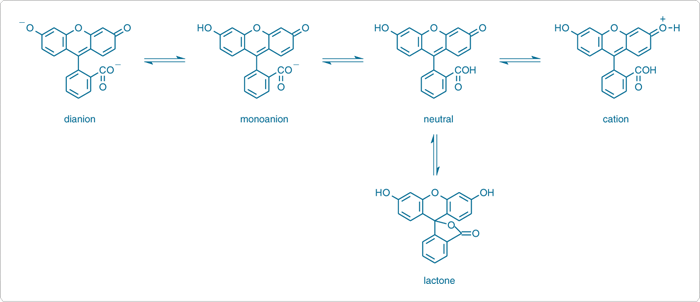

Absorption and fluorescence spectral characteristics, such as wavelengths, intensities and bandwidths, of a molecule depend strongly on the actual form of the molecule in the solution. The forms of the molecule depend on the natures of both the molecule and the solvent and the pH of the solution. For example, fluorescein molecule, a commonly used biological probe, appears in various ionic and neutral forms like cation, monoanion, dianion, and neutral forms depending on the pH values of the solution (Figure 1). This leads to its pH-dependent absorption and emission spectra.

  

Figure 1. Different molecular forms of fluorescein.

T In aqueous solution, fluorescein exists in cationic, anionic, and neutral forms depending on the pH. It has a phenol and a carboxylic acid functional group and exhibits multiple pH-dependent ionic equilibria. Both the functional groups of fluorescein are almost totally ionized in aqueous solutions above pH 9. Upon acidification, i.e., upon decreasing the pH, the fluorescein dianion protonates first to form the phenol (pKa ~6.4) giving rise to the fluorescein monoanion (carboxylate). Next the carboxylate anion protonates (pKa ~4.3) forming neutral species of fluorescein. Upon further acidification, a fluorescein cation (pKa ~2.1) is formed. In the pH range 2 to 4, fluorescein exists mainly in neutral form along with a small number of monoanion and dianion forms in the solution. The number of the monoanion increases with the increase in pH values in the range of pH = 4.3 - 6.47. The dianion form becomes the most prevalent form at further high pH.

The dianion has its main absorption peak 490 nm (εM = 76900 M-1cm-1) with a shoulder at ~475 nm. The monoanion has two peaks at ~453 nm and ~472 nm with almost similar εM = 29000 M-1cm-1. The neutral species has a peak at ~435 nm in the visible spectral region with lowest absorption (εM = 11000 M-1cm-1) of all the species. A blue shift and a decrease in absorbance in the absorption spectra of fluorescein have been observed with the decrease in pH. 

The neutral and monoanion forms of fluorescein have similar fluorescence spectra in aqueous solution. The dianion form shows a narrower emission band. The lactonic form does not contribute to the fluorescence much because it does not absorb in the visible spectrum. The lactone form is prevalent in organic solvents. Therefore, it is interesting to study pH-dependent fluorescence of fluorescein in organic solvents. Though we are familiar with pH of aqueous solutions, the hydrogen ion concentration can also be measured in organic solvents like methanol, ethanol, etc. The pH of the solutions of fluorescein in methanol is ~4. Therefore, the methanolic solution is expected to contain mostly the monoanion form of fluroscein with a few dianions. Aqueous NaOH solutions can be added to methanolic solution to increase the pH from 4 to 6.4 or more where dianion form of fluorescein dominates. Thus the excitation and emission spectra vary with varying pH of the solution. The difference between the maximum excitation and emission wavelength represents the Stokes shift, the energy lost during relaxation. 
